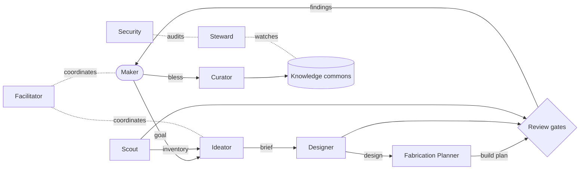

# Agentic Worker Roles

> **Status:** v0 draft. Roles are deliberately small and single-purpose so they
> can be granted least privilege and audited independently. Each maps to a
> configurable agent (a `deepagents` sub-agent in the current scaffold).

## Trust model

Three tiers, by what an agent is allowed to do:

| Tier | Agents | Authority |
|---|---|---|
| **Propose** | Scout, Ideator, Designer, Fabrication Planner, Mentor | May read the commons and produce artifacts. Cannot bless, cannot take irreversible or outward-facing actions. |
| **Gate** | Ecology & Safety Reviewer, Provenance & Ethics Reviewer, Security Reviewer | May **block**. Emit signed review artifacts. Cannot design or modify project content. |
| **Platform** | Steward, Curator, Facilitator | Operate the platform itself under least privilege. Actions are logged to the append-only decision log and are themselves subject to Security review. |

A human checkpoint is required to **bless** a project, to override a gate, and
before any irreversible or outward-facing action.

## Making pipeline (Propose tier)

### Scout / Sourcing
- **Mission:** find and catalog available materials.
- **Inputs:** user photos and inventory notes, opt-in local material map, donor
  streams, the e-waste teardown catalog.
- **Outputs:** structured inventory items — type, condition, quantity,
  location, **provenance** — plus teardown notes for unfamiliar devices.
- **Tools:** vision, catalog lookup, local DB write (inventory only).
- **Guardrail:** never records a source that cannot be attributed; hands
  ethically questionable sources straight to Provenance & Ethics.

### Ideator
- **Mission:** match materials + a person's goal + the principles to candidate
  projects; grow the seed-ideas library.
- **Outputs:** ranked **project briefs** (problem, intent, materials, AI angle,
  principle check, unknowns).
- **Guardrail:** every brief carries an explicit principle check; salvage-first
  violations are surfaced, not hidden.

### Designer
- **Mission:** turn a brief into a concrete design.
- **Outputs:** bill of materials, drawings or parametric models, tolerances
  chosen for salvaged-part variance, disassembly and end-of-life paths.
- **Tools:** CAD/geometry, the salvaged-part variance library, calculators.

### Fabrication Planner
- **Mission:** turn a design into a build a specific person can actually do.
- **Outputs:** ordered steps, jigs, required tools, PPE and ventilation, skill
  level, time estimate — adapted to the maker's real shop.

### Mentor
- **Mission:** lower the barrier for new contributors: explain, teach a skill,
  walk a build, translate jargon.
- **Guardrail:** advisory only; defers to Fabrication Planner and the gates on
  anything safety-related.

## Review gates (Gate tier)

### Ecology & Safety Reviewer
- **Checks:** toxicity, emissions, fire/electrical/mechanical hazard, energy
  over lifecycle, e-waste created vs. diverted, effect on land and water.
- **Output:** a signed review artifact with findings and a pass / block / needs
  changes verdict. **Blocking.**

### Provenance & Ethics Reviewer
- **Checks:** every material has an attributable source; no theft, exploitation,
  or ecological harm in sourcing; licensing and credit for reused designs;
  respect for land stewardship when harvesting natural material.
- **Output:** signed artifact; **blocking** on provenance failures.

### Security Reviewer
- **Checks:** supply chain of code, models, and tool dependencies; sandbox and
  permission policy for other agents; secret hygiene; review of any
  Platform-tier action that touches the network or the host.
- **Output:** signed artifact; **blocking** on unresolved high-severity issues.

## Platform (Platform tier)

### Steward (self-healing / SRE)
- **Mission:** keep the platform healthy and local-first.
- **Does:** health probes, retry and reroute failed jobs, resume from
  checkpoints, run and verify backups of the commons, schedule heavy compute
  into low-carbon windows.
- **Guardrail:** idempotent operations only; every repair action is logged.

### Curator / Librarian
- **Mission:** fold contributions into the commons.
- **Does:** normalise docs, attach license and provenance, deduplicate, index
  for search, check reproducibility completeness.

### Facilitator / Orchestrator
- **Mission:** run multi-player sessions.
- **Does:** route tasks between people and agents, hold the task graph, record
  decisions to the append-only log, surface conflicts for human resolution,
  enforce the "humans decide" checkpoints.

## Role interaction (happy path)

