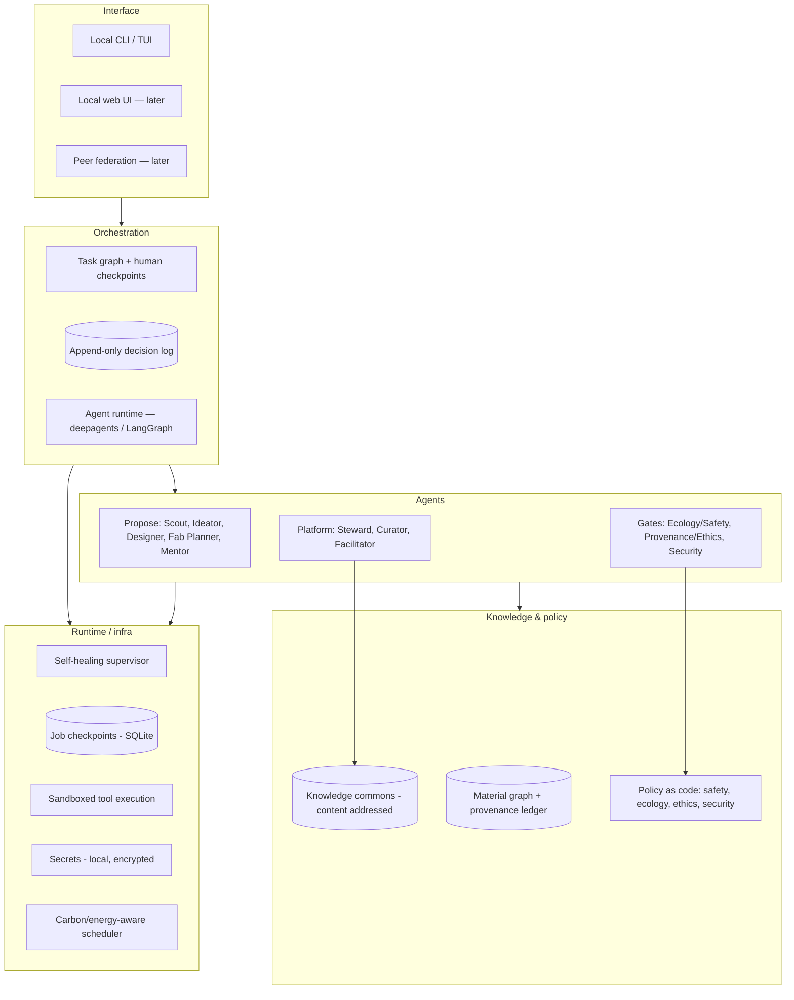

# Platform Architecture

> **Status:** v0 draft for discussion. Describes the target shape; the repo
> today contains only the agent scaffold (`solarphunk/`).

## Constraints (from the [principles](principles.md))

| Principle | Architectural consequence |
|---|---|
| 1 Sufficiency, then salvage | Ideation proposes the smallest intervention first; every design records disassembly and end-of-life paths. |
| 2 Appropriate technology | Model-agnostic; prefer small/local inference; measure and log compute and energy per job. |
| 3 Safety and provenance are gates | Review gates are in the critical path, not optional plugins; signed artifacts; append-only provenance ledger. |
| 4 An open knowledge commons | Commons uses open, inspectable, exportable formats; content-addressed. |
| 5 Local-first and resilient | Everything core works offline on modest hardware; jobs resumable and idempotent; supervisor retries, reroutes, restores. |
| 6 Many hands, human judgment | Multi-player sessions and an append-only decision log are first-class; human checkpoint for irreversible actions. |
| 7 Built with care, made to delight | Build plans state PPE / skill / time; briefs carry form-and-feeling intent. |

## Layers



### Interface
Local CLI/TUI is the v0 control surface (the `solarphunk` command). A local web
UI and opt-in peer federation come later. Federation shares the commons as
signed bundles between peers — no central authority.

### Orchestration
An agent runtime (currently `deepagents` on LangGraph) executes a **task graph**
with explicit human-in-the-loop checkpoints. Every decision — human or agent —
is written to an append-only **decision log**.

### Agents
The roles in [agent-roles.md](agent-roles.md), each a configurable agent with a
**least-privilege** tool grant. Propose-tier agents can only read the commons
and write artifacts; Gate-tier agents can block and sign; Platform-tier agents
run the system and are audited by Security.

### Knowledge & policy
- **Knowledge commons** — content-addressed store of briefs, designs, BOMs,
  build logs, and review artifacts. Local SQLite index; exportable bundles.
- **Material graph** — inventory of materials and parts with condition,
  location, and a link into the **provenance ledger** (append-only, signed).
- **Policy as code** — the gate checks, versioned alongside the principles they
  enforce. A blessed project stores the policy version it passed.

### Runtime / infra
Local-first nodes. The **self-healing supervisor** owns job health: idempotent
steps, checkpoint/resume, retry, reroute around a degraded node, backup and
verify. Tool execution is **sandboxed**. Secrets live in an encrypted local
store, never in the repo. A **carbon/energy-aware scheduler** batches heavy
compute into low-impact windows and prefers cached results.

## Core data model (sketch)

```
Material        id, type, condition, qty, location, provenance_ref
ProvenanceEntry id, subject_ref, source, consent, method, signed_by, ts   (append-only)
Idea            id, intent, materials[], ai_angle, principle_check
ProjectBrief    id, idea_ref, goal, form_intent, constraints, status
Design          id, brief_ref, bom[], models[], tolerances, eol_paths
BuildPlan       id, design_ref, steps[], tools[], ppe, skill, time_est
ReviewArtifact  id, project_ref, kind(ecology|ethics|security), verdict,
                findings[], policy_version, signed_by, ts
Contribution    id, project_ref, author, license, ts
Decision        id, session_ref, actor(human|agent), choice, rationale, ts   (append-only)
Node            id, capabilities, health, last_seen
```

## Cross-cutting

- **Security:** least privilege per agent; signed gate artifacts; append-only
  logs; supply-chain verification of code/models/tools; sandboxed `execute`.
- **Self-healing:** supervised, idempotent jobs; checkpoint/resume; health
  probes; automatic retry and reroute; periodic backup + restore test.
- **Environmental safety of the platform itself:** default to small/local
  models; schedule for low-carbon windows; log energy per job; cache
  aggressively; make the platform's own footprint visible.

## Roadmap

| Phase | Scope |
|---|---|
| **0 — Foundation** | These docs. Agent scaffold. Local SQLite commons + material inventory. Scout + Ideator producing briefs. |
| **1 — Pipeline** | Designer + Fabrication Planner. Ecology/Safety and Provenance/Ethics gates as advisory, then blocking. Human `bless` writes signed artifacts. |
| **2 — Platform** | Steward self-healing, Curator normalisation, Facilitator multi-player sessions, Security audit loop. Local web UI. |
| **3 — Federation** | Signed commons bundles shared between peer nodes; no central service. |
